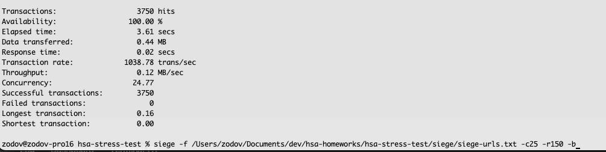

# hsa-stress-test
HSA homework 3 - stress test

## How to start
1. Clone the repo to local machine
2. Head to `./server` on local machine and run `npm install` (required once to create node_modules folder before it will be projected to inner docker container filesystem)
3. Head to root of the cloned repo
4. Create actual `.env` file from `.env.dist` in the `./server` folder
5. Run `docker-compose up -d`

## How to test
1. Install siege
2. Provide/config it to accept given file `./siege/siege-urls.txt`
3. Run siege with console command `siege -f ./siege/siege-urls.txt -c[concurrency_value] -r[requests_per_user_value] -b`
4. Observe siege output and final summary

## Proofs

 
 
 
 
 